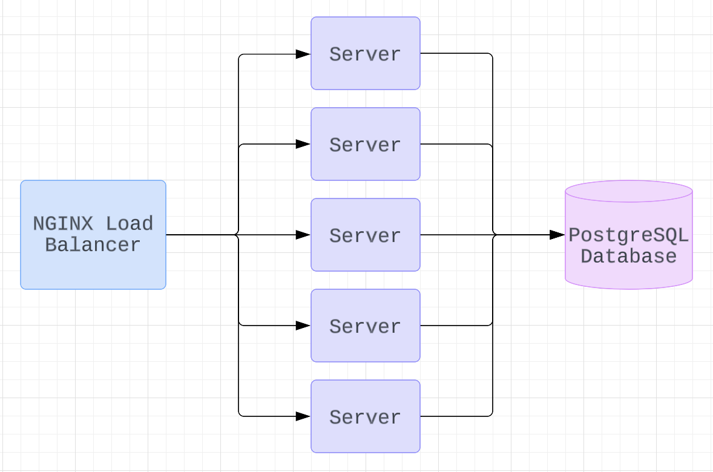

# Project Atelier Reviews Microservice

This project transforms the backend of the reviews feature for an E-commerce application from a monolith architecture to a microservice to increase scalability and improve fault isolation. The third-party API was discarded for this feature and replaced with an internal, RESTful API. This microservice was stress tested locally and remotely with tools like K6 and Loader.io and improvements were implemented based on metrics collected with New Relic.

Load balancing with NGINX was performed on the deployed AWS EC2 instance to support 1,400 requests per second

##### For installation: npm install, followed by npm run server-dev

##### For usage: check out https://github.com/FEC-Boson/rpp2209-fec-boson for access to the frontend application 
